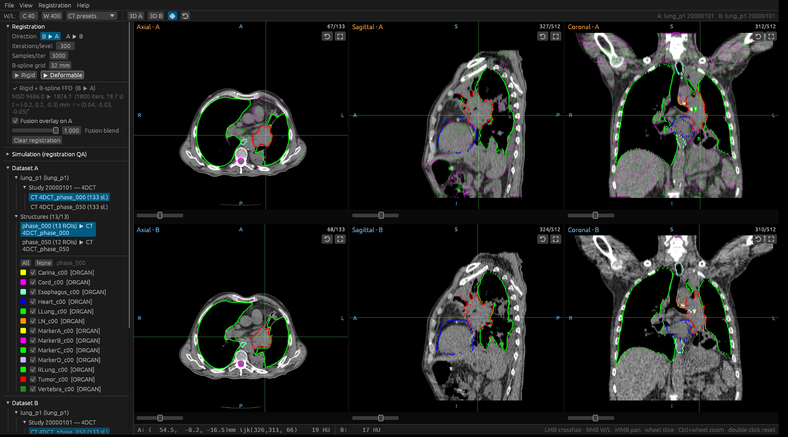

# rust-dicom-viewer

A fast, robust DICOM / RT DICOM viewer written entirely in Rust. It loads a
full radiotherapy study — image series (CT/MR/PT), RT Structure Set, RT Dose
and RT Plan (photon and ion/proton) — and displays it in the classic
three-view MPR layout: **axial, sagittal and coronal side by side** with
linked crosshairs. A **comparison mode** stacks a second study below the
first for six views total, and built-in **rigid and deformable (B-spline)
image registration** — elastix-style algorithms implemented natively in
Rust — aligns the two studies with a fusion overlay.




## Features

**Image volumes.** A directory scan classifies every DICOM file (parallel
header-only pass), groups image series, and reconstructs a 3D volume from the
largest series by default (switchable in the toolbar). Slices are decoded in
parallel with `rayon`, sorted along the true slice normal, checked for
uniform spacing and consistent dimensions, and rescaled to HU. Compressed
transfer syntaxes (JPEG lossless, RLE, …) are handled by `dicom-rs`'s pure
Rust decoders.

**RTSTRUCT.** ROI names, display colors, interpreted types (PTV, ORGAN,
EXTERNAL, …) and all planar contours. Axial views draw the native closed
contours; sagittal/coronal views show the reconstructed cross-section
silhouette. Per-ROI visibility toggles.

**RTDOSE.** 16/32-bit dose grids with `DoseGridScaling`,
`GridFrameOffsetVector` (uniform or not, ascending or descending), trilinear
patient-space sampling, translucent colorwash and marching-squares isodose
lines at configurable percentages of a reference dose (prescription dose is
picked up from the plan automatically). Multiple dose files (plan/beam doses)
are selectable.

**Comparison mode.** Load a second study (menu *File → Open comparison
study (B)…* or *View → Comparison mode*, or pass two directories on the
command line) and the window splits into two rows of three views — study A
on top, study B below, six panels total. Each study keeps its own structures,
dose and plan panels in the sidebar; window/level and dose display settings
are shared so both CTs are windowed identically. The crosshair is linked
between the studies through **patient coordinates** (toggleable via *View →
Link crosshairs between studies*): clicking a point in one study moves the
other study's crosshair and slices to the same anatomical position — the
status bar then shows HU and dose readouts for A and B side by side. Study B
can be closed again from the File menu, and comparison mode can be switched
on/off at any time without unloading anything.

**Image registration (rigid & non-rigid).** With two studies loaded, the
*Registration* menu (or the sidebar section) registers one study onto the
other — the direction is selectable (**B ▶ A** or **A ▶ B**; the second
study named is the fixed image, and the fusion overlay is drawn on its
views). The engine follows the [elastix](https://elastix.dev) framework —
[SuperElastix/elastix](https://github.com/SuperElastix/elastix) is a C++/ITK
toolbox, so its core algorithms are **re-implemented natively in Rust** to
keep the application single-language:

* multi-resolution Gaussian pyramids (`NumberOfResolutions`, default 3);
* random-coordinate sampling with fresh samples every iteration
  (`NumberOfSpatialSamples`, default 3000), restricted to a body threshold
  mask;
* mean-squared-difference metric with analytic gradients;
* **Adaptive Stochastic Gradient Descent** (Klein et al., IJCV 2009 —
  elastix's default optimizer) with automatic gain estimation, the
  sigmoid time-adaptation rule and a trust-region step cap;
* **rigid**: 6-DOF Euler transform about the fixed-image center with
  automatic rotation/translation parameter scaling;
* **deformable**: rigid pre-alignment composed with a cubic B-spline
  free-form deformation on a regular grid
  (`FinalGridSpacingInPhysicalUnits`, default 32 mm).

Registration runs on a background thread (progress + cancel in the sidebar)
and typically takes seconds thanks to stochastic sampling. The result panel
reports the direction, the metric before/after, the recovered
translation/rotation, and enables a **magenta/green fusion overlay** on the
fixed study (fixed image in magenta, the transformed moving image in green —
aligned anatomy reads gray) with a blend slider. The cross-study crosshair
link maps through the recovered transform (inverse included), so clicking a
point in either study lands on the same anatomy in the other. Iterations, samples and grid spacing are adjustable in the
sidebar. Accuracy is verified in `tests/registration.rs` against analytically
known transforms: sub-millimeter recovery for both a rigid rotation +
translation and a 7 mm Gaussian-bump deformation.

**Planar images (DX / CR / RTIMAGE).** Digital radiographs and RT images
(DRRs, portal / setup images) found in the study folder are listed in the
sidebar and open in floating viewer windows with their own window/level
(DICOM default, auto, or manual), correct physical aspect ratio
(imager / image-plane pixel spacing), MONOCHROME1 inversion, and the
relevant metadata — body part, view and kVp for DX; machine, gantry angle,
SAD and SID for RTIMAGE.

**REG — Spatial Registration objects.** Rigid Spatial Registration files are
parsed into their 4×4 frame-of-reference transformation matrices, shown with
the decomposed translation/rotation and frame-of-reference hints (matched
against the loaded studies' FoR UIDs). A matrix can be **applied as the
active registration** in either direction (with an optional inversion), so a
TPS-exported registration immediately drives the fusion overlay and the
cross-study crosshair link without running the optimizer. Deformable REG
objects are recognized and their rigid matrices read; deformation grids are
not applied.

**RTRECORD — treatment records.** RT (Ion) Beams Treatment Records are
summarized per session: fraction number, date, machine, and a per-beam table
of specified vs delivered meterset with the percentage difference and the
termination status (non-NORMAL terminations highlighted).

**Transform simulator & DICOM export (registration QA).** The *Simulation*
sidebar section applies an exactly-known transform to a loaded study — rigid
motion (translation + Euler rotation about the volume center) plus an
optional local Gaussian deformation (amplitude vector + σ, centered at the
crosshair) — and generates the result into the other study slot: the CT is
resampled through the inverse transform, and structure contours, dose grids
and plan isocenters are carried along. The applied parameters stay displayed
as the ground truth, so you can immediately run the built-in registration and
compare the recovered transform against it (on the synthetic phantom the
rigid recovery matches to sub-millimeter/sub-degree). Any loaded study —
original or simulated — can be exported as a set of DICOM files (*Export
A/B…*): one CT Image Storage file per slice plus RTSTRUCT, RTDOSE (16-bit
with `DoseGridScaling`) and an RTPLAN skeleton (photon or ion), written with
`dicom-rs` in Explicit VR Little Endian, sharing the source frame of
reference. The exports round-trip through this viewer and pydicom; they are
QA/research objects, not guaranteed-complete clinical IODs.

**RTPLAN.** Photon (`BeamSequence`) and ion/proton (`IonBeamSequence`) plans:
prescription, fractionation, and a per-beam table with radiation type, scan
mode, gantry/couch angles, energy range, meterset and control-point count.
Beam isocenters are marked in all three views.

**Interaction** (shown in the status bar):

| Input | Action |
|---|---|
| Left click / drag | Move the linked crosshair (all views follow) |
| Mouse wheel | Scroll through slices |
| Ctrl + wheel / pinch | Zoom (anchored at the cursor) |
| Middle drag | Pan |
| Right drag | Window/level (x = width, y = center) |
| Double click | Reset zoom & pan |

Common CT window presets (brain, subdural, stroke, head/neck soft tissue,
temporal bone, lungs, mediastinum, abdomen, liver, spine, bone, CT angio,
full range), anatomical
edge labels (L/R/A/P/S/I) derived from the actual patient orientation, and a
status bar with patient coordinates, voxel indices, HU and dose (Gy and % of
reference) at the crosshair.

## Performance

Everything is CPU-side Rust + GPU texture blitting via `wgpu`; the hot paths
are cached and only recomputed when their inputs change (slice, W/L, dose
settings, ROI visibility). Measured on the bundled synthetic study: full
study load ≈ 40 ms, orthogonal slice extraction ≈ 6 µs, dose-plane resampling
≈ 0.3 ms. Loading runs on a background thread with progress display, and
per-slice decode is parallelized across cores. Volumes are stored as `i16`
(HU), dose grids as `f32`.

## Building

Requires a Rust toolchain (<https://rustup.rs>). Then:

```
cargo build --release
```

Run with optional directory arguments — one study, or two to start straight
in comparison mode:

```
cargo run --release -- "D:\path\to\study_A"
cargo run --release -- "D:\path\to\study_A" "D:\path\to\study_B"
```

or start it empty and use *Open folder…* / the *File* menu. Windows, Linux
and macOS are supported; rendering uses `wgpu` (DX12/Vulkan/Metal, with
fallbacks).

## Tests & synthetic data

`tools/generate_test_data.py` (needs Python + `pydicom`, only for test-data
generation — the viewer itself is pure Rust) writes a synthetic study to
`test_data/`: a cylindrical water phantom with a spherical target, three
ROIs, a 3D Gaussian 60 Gy dose and a two-beam proton plan with analytically
known values. The integration tests verify geometry round-trips, HU values,
contour radii, trilinear dose values, isodose radii and plan fields against
the closed-form expectations:

```
python3 tools/generate_test_data.py
cargo test --release
```

A second, shifted study for trying comparison mode and registration:

```
# deformable scenario: same body, target displaced 15 mm
python3 tools/generate_test_data.py --out test_data2 --target-shift-y 15 --peak 66
# rigid scenario: whole phantom translated (12, -9) mm
python3 tools/generate_test_data.py --out test_data3 --shift-x 12 --shift-y -9
cargo run --release -- test_data test_data3
```

Then *Registration ▶ Rigid* should recover the (12, −9, 0) mm shift to within
a fraction of a millimeter, and *Registration ▶ Deformable* on
`test_data2` warps the displaced target back onto study A.

## Structure

```
src/
  main.rs      entry point (eframe/wgpu window)
  app.rs       egui application: three-view layout, panels, interaction
  loader.rs    directory scan, classification, parallel volume loading
  extras.rs    DX/CR/RTIMAGE planar images, REG spatial registrations,
               RTRECORD treatment records
  registration.rs  elastix-style rigid + B-spline registration (ASGD,
               multi-resolution, random sampling) in pure Rust
  simulate.rs  known-transform study generator for registration QA
  dicom_export.rs  DICOM writer (CT series, RTSTRUCT, RTDOSE, RTPLAN)
  volume.rs    3D volume, patient-space geometry, orthogonal slice extraction
  rtstruct.rs  RT Structure Set parsing
  rtdose.rs    RT Dose parsing + trilinear patient-space sampling
  rtplan.rs    RT Plan / RT Ion Plan parsing
  render.rs    window/level, dose colorwash, marching-squares isodose,
               contour/plane intersection
  geometry.rs  minimal 3D vector math
```

## Notes & limitations

The three views are extracted in the acquisition index space, which maps
directly onto axial/sagittal/coronal planes for standard axial acquisitions;
oblique acquisitions display consistently but the plane names are nominal
(edge labels always reflect the true patient directions). Enhanced
multi-frame image series are not yet supported (classic single-frame series
only). Non-uniform slice spacing is detected and reported as a warning, with
the median spacing used for display. The registration metric is
mean-squared-difference, appropriate for mono-modal (CT–CT) alignment;
mutual information for CT–MR is a natural extension. Deformable results are
intensity-driven: displacements inside large uniform regions are
interpolated from the B-spline grid rather than measured. This software is a
viewer for research and QA convenience — not a medical device, and not for
clinical decision-making.
