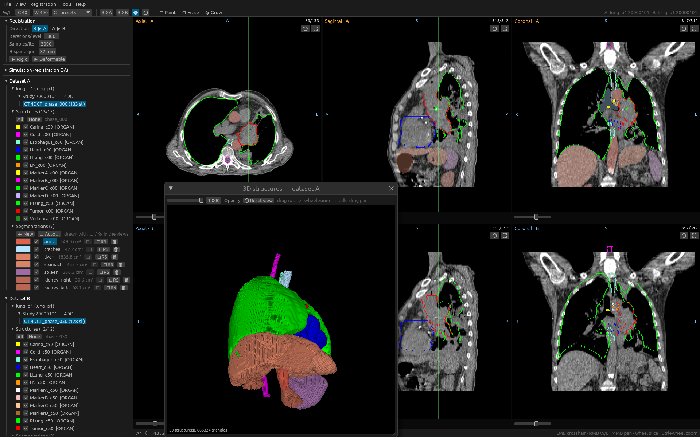

# rust-dicom-station

[](https://github.com/alexprotom/rust-dicom-station/actions/workflows/ci.yml)

RDS (Rust DICOM Station) is open-source software for medical imaging and radiotherapy research, analysis, and QA, **written entirely in Rust**. It loads complete radiotherapy studies (CT, MR and PET series, RTSTRUCT, RTDOSE, photon and ion RTPLAN, DICOM SEG, planar images, spatial and deformable registrations, and treatment records) into an integrated environment for visualization, comparison and quantitative analysis. Beyond the classic linked three-view layout and dual-dataset comparison, RDS provides image registration, structure propagation, DRR generation, dose-volume histograms, 4D motion analysis, interactive and AI-assisted segmentation, 3D visualization, and DICOM editing and export. The entire processing stack is native Rust: functionality normally provided through C/C++ or Python frameworks, including elastix- and plastimatch-style registration, ITK-style ray casting, TotalSegmentator, SegVol, and MedSAM2, is re-implemented directly in Rust without bindings to those frameworks.



*The bundled 4D-Lung patient: two breathing phases as two rows of linked MPR
views with their RTSTRUCT contours, and the 3D window showing the RTSTRUCT
surfaces together with organs auto-segmented by the built-in TotalSegmentator
engine.*

## What it does

* **Viewing** - parallel DICOM loading (compressed syntaxes included), true
  patient-space geometry, linked axial / sagittal / coronal views, W/L
  presets, dose colorwash and isodose lines, per-beam plan summaries, planar
  images (DX / CR / RTIMAGE), dark and light themes. Folders *or* individual
  files, and **the data does not have to be a volume**: a portal image, a
  structure set or a plan opens on its own, in the ordinary tree, with
  everything that does not need voxels still working.
* **Datasets** - a patient ▶ study ▶ series tree per dataset; copy / move /
  remove / rename at every level with the reference chains kept intact; RT
  structure sets and segmentation series as tree nodes, contours and masks
  converting as they move between them; six-view comparison mode.
* **Patient archive** - a local PACS on plain folders and text sidecars:
  file a study, list patients without opening a DICOM file, load into either
  dataset, and send the structures and segmentations you drew back as derived
  objects under the original Study and Frame of Reference UIDs.
* **Registration** - rigid and B-spline after **elastix** (pyramids,
  stochastic sampling, ASGD), dense B-spline after **plastimatch** (analytic
  gradient, bending energy, L-BFGS, mean squares or Mattes mutual
  information) and plastimatch's **landmark warp**; any of them restricted to
  one structure or refined on top of a previous result. Every run reports its
  6 DOF, displacement statistics, Jacobian determinant and folding; the vector
  field draws in the views and in 3D; fusion overlay; DICOM REG and Deformable
  Spatial Registration read and written; a known-transform simulator for QA.
* **Structure propagation** - contours and segmentations carried through a
  registration by per-voxel pull-back (no holes, any two grids), optionally
  refined on an enclosing structure first.
* **4D / motion** - phases recognised into 4D groups; the reference phase
  registered to every other, targets propagated and their centroids tracked;
  peak-to-peak, drift, correlation with a reference structure, ITV
  generation, a results window with run-vs-run comparison and CSV export;
  structure comparison (Dice, HD95, surface distance) and transfer by
  relationship.
* **MCP server** - `rds-mcp`, a second executable that lets an AI assistant
  drive the station's tools (load, segment, register, propagate, 4D motion,
  DVH, export) headlessly over the Model Context Protocol, with a
  ready-made prompt for heart target propagation; datasets that still name
  their patient are refused by default and no tool ever returns identifiers.
* **DRR** - plastimatch's exact Siddon tracer and ITK's interpolating
  ray-cast on one IEC cone-beam geometry, beam's-eye view from an RTPLAN
  beam, side by side with their difference.
* **Dose-volume histograms** - cumulative and differential DVHs of any
  structures against any dose, sampled on the structure's own lattice;
  `D95%` / `D2cc` / `V20Gy` metrics, protocol constraint checking, CSV
  export; verified against an analytic phantom.
* **Segmentation** - spacing-aware 2D / 3D brush and eraser, geodesic region
  growing, undo, live 3D surfaces, mask ⇄ RTSTRUCT, DICOM SEG import and
  export (binary and fractional).
* **Structure algebra** - union / intersection / subtraction / symmetric
  difference with margins in patient directions (exact ellipsoids), crop,
  ring, cleanup.
* **Body contour** - the EXTERNAL structure without the couch, the chair or
  the mask, on CT and MR, classically or guided by TotalSegmentator's body
  network.
* **Auto-segmentation** - TotalSegmentator v2 rebuilt natively (117
  structures): official nnU-Net weights converted without Python, a SIMD CPU
  engine or a wgpu GPU path (no CUDA), mean Dice 0.9995 against the
  reference.
* **Prompt segmentation** - SegVol rebuilt natively: box, click or free-text
  prompts ("liver", "tumor") for the structures no fixed-class model covers.
* **Slice propagation** - MedSAM2 (SAM 2.1 with its memory bank) rebuilt
  natively: box a structure on one slice, refine with include / exclude
  clicks, follow it through the stack at native resolution.
* **Tools** - DICOM export with an editable tag table, a model manager for
  every downloadable weight, a folder anonymizer with consistent UID
  regeneration, a synthetic RT-study generator; every tool window can be
  moved to its own monitor.

## Architecture

One language, one binary. All image processing runs on the CPU with `rayon`
and caching; the GPU (`wgpu`: DX12 / Vulkan / Metal) blits the UI and,
optionally, runs the networks. Long operations run on worker threads with
progress and cancellation. The module map, threading model, geometry
conventions and test suites are in
[docs/architecture.md](docs/architecture.md).

## Quick start

Requires a Rust toolchain (<https://rustup.rs>).

```
cargo build --release
cargo run --release -- example_data/lung_p1_4DCT_phase_000
cargo run --release -- example_data/lung_p1_4DCT_phase_000 example_data/lung_p1_4DCT_phase_050
cargo test --release
```

To try prompt segmentation on the bundled patient: put the crosshair on the
tumor, *Tools ▶ 💬 Prompt-segment dataset A…*, prompt **Box**, **▶ Segment**.
The engines fetch their weights on first use into one model folder
(`%LOCALAPPDATA%\RustDICOMStation\models` on Windows,
`~/.local/share/RustDICOMStation/models` on Linux), movable from any tool
window; each engine also has a headless CLI in [examples/](examples/).

If the program will not start at all, it is almost certainly one thing: a
Windows machine advertising a Vulkan driver that cannot create a device. It
now falls back to Direct3D 12 by itself, the installer asks which backend to
use, and *View ▸ Graphics backend* changes it afterwards - see
[docs/viewer.md](docs/viewer.md#graphics-backend).

Windows, Linux and macOS are supported; `--no-default-features` builds a
CPU-only viewer without the GPU inference backend. Every push to `main`
publishes a release: a Windows installer
(`rust-dicom-station-<version>-windows-x86_64.exe` - shortcuts, "Open with"
on folders, the VC++ runtime check, optional weight prefetch, uninstaller)
and a Linux AppImage. The installer is its own crate in
[installer/](installer/README.md). No data at hand? *File ▶ 📐 Generate test
data…* writes a complete synthetic RT study, and `example_data/` ships a real
two-phase 4DCT ([docs/example-data.md](docs/example-data.md)).

## Documentation

https://alexprotom.github.io/rust-dicom-station/

| | |
|---|---|
| [docs/viewer.md](docs/viewer.md) | Loading folders and single files, datasets with no volume, MPR views, dataset tree, comparison mode, interaction reference, the graphics backend |
| [docs/rt-objects.md](docs/rt-objects.md) | RTSTRUCT, RTDOSE, RTPLAN, REG, RTRECORD, reference chains |
| [docs/registration.md](docs/registration.md) | The four registration engines, local registration, analytics, vector fields, fusion, simulator, verification |
| [docs/propagation.md](docs/propagation.md) | Carrying contours and segmentations across a registration |
| [docs/motion-4d.md](docs/motion-4d.md) | 4D groups, the motion / ITV workflow, results, structure comparison and transfer |
| [docs/drr.md](docs/drr.md) | Digitally reconstructed radiographs: the two projectors and the geometry |
| [docs/dvh.md](docs/dvh.md) | Dose-volume histograms: curves, metrics, constraint checking, export |
| [docs/segmentation.md](docs/segmentation.md) | Brush / eraser / region growing, 3D view, mask → RTSTRUCT |
| [docs/structure-algebra.md](docs/structure-algebra.md) | Boolean operations, margins, cropping, cleanup |
| [docs/body-contour.md](docs/body-contour.md) | The body / EXTERNAL contour on CT and MR, verification |
| [docs/auto-segmentation.md](docs/auto-segmentation.md) | The pure-Rust TotalSegmentator: models, pipeline, engines, validation, classes, licensing |
| [docs/segvol.md](docs/segvol.md) | Prompt-driven segmentation: the SegVol re-implementation |
| [docs/medsam2.md](docs/medsam2.md) | Propagating a prompt through a stack: the MedSAM2 re-implementation |
| [docs/pacs.md](docs/pacs.md) | The local patient archive: window, on-disk layout, filing, loading, sending changes back |
| [docs/export-and-tools.md](docs/export-and-tools.md) | DICOM export, the model manager, anonymizer, test-data generator |
| [docs/mcp.md](docs/mcp.md) | The MCP server: tools, the heart workflow prompt, patient-identity safety, configuration |
| [docs/architecture.md](docs/architecture.md) | Design, functional overview, module map, threading, the model folder, conventions, testing |
| [docs/release-versioning.md](docs/release-versioning.md) | How versions and releases are produced |
| [docs/example-data.md](docs/example-data.md) | Bundled patient data, source and citations |
| [installer/README.md](installer/README.md) | The Windows installer: building it, what it installs, silent switches |

## License and citations

The code is MIT-licensed. The bundled example data is TCIA **4D-Lung**
patient P102, redistributed under CC BY 3.0 (cite it as described in
[docs/example-data.md](docs/example-data.md)). Auto-segmentation uses
TotalSegmentator's Apache-2.0 "total"-task weights (cite Wasserthal et al.
(Radiology AI 2023) and nnU-Net (Isensee et al., Nature Methods 2021) as
described in [docs/auto-segmentation.md](docs/auto-segmentation.md)). Prompt
segmentation re-implements SegVol (Du et al., NeurIPS 2024) and slice
propagation MedSAM2 (Ma et al., 2025); their weights are only ever
downloaded from Hugging Face to your own machine at your request and are
never redistributed; see [docs/segvol.md](docs/segvol.md) and
[docs/medsam2.md](docs/medsam2.md).

This software is a viewer for research and QA convenience. **Not a medical
device, and not for clinical decision-making.**
