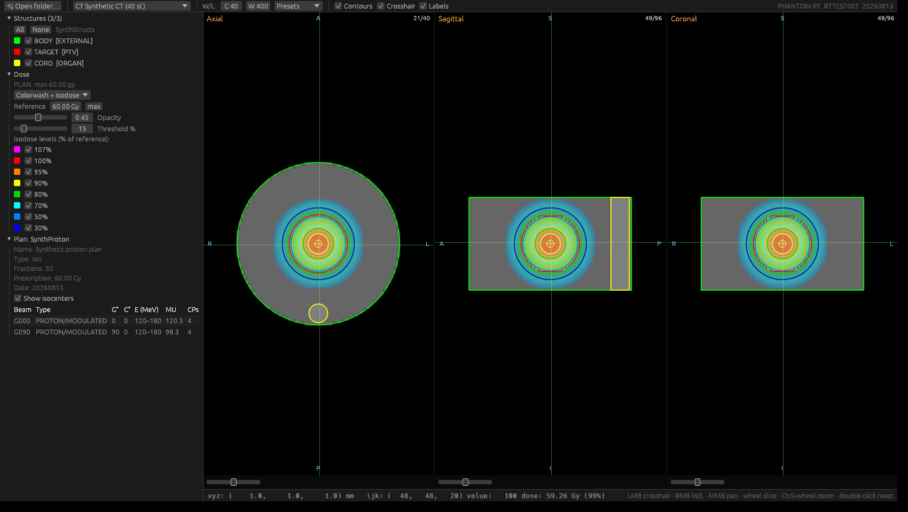
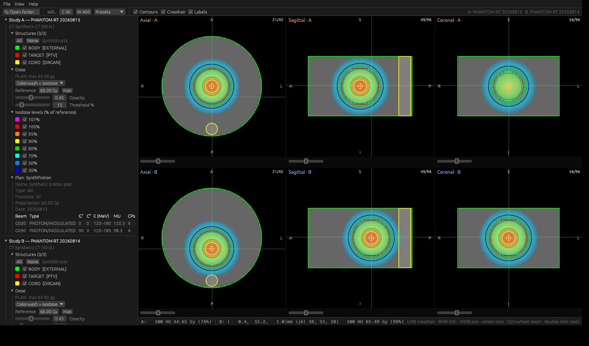

# Image viewing, datasets and interaction



*A lung 4DCT phase with its RT Structure Set. The crosshair sits in the tumor;
the axial view draws the native RTSTRUCT contours, sagittal/coronal show
reconstructed cross-sections of the same ROIs.*

## Loading and volume reconstruction

Data comes in either way round: a whole folder (*File ▶ Add DICOM folder…*, or
directory arguments on the command line) or an explicit handful of files
(*File ▶ Add DICOM file(s)…*, multi-select). Both start the same background
scan and both merge into the dataset the same way — a file selection is not a
separate mode with its own rules, it is a study that happens to be small.

The scan:

1. **Classification.** Every file in the tree is read header-only (no pixel
   data) in parallel and classified by SOP class / modality: image series
   (CT/MR/PT/…), RTSTRUCT, RTDOSE, RTPLAN, planar images (DX/CR/RTIMAGE), REG
   spatial registrations, RT treatment records. Unreadable or foreign files
   become warnings, never errors.
2. **Series grouping.** Image files are grouped by SeriesInstanceUID into the
   dataset tree; the largest series is reconstructed first (click another to
   switch).
3. **Volume reconstruction.** Slices are decoded in parallel (`rayon`) —
   compressed transfer syntaxes (JPEG lossless, RLE, …) via `dicom-rs`'s
   pure-Rust decoders — sorted by projection onto the true slice normal (cross
   product of the ImageOrientationPatient row/column vectors), checked for
   uniform spacing and consistent dimensions, and rescaled to HU with the
   per-file rescale slope/intercept. The result is one `i16` volume with full
   patient-space geometry (origin at the center of voxel (0,0,0), unit
   direction vectors for the three axes, spacing in mm).

Non-uniform slice spacing is reported as a warning (the median spacing is used
for display) and duplicate slice positions are collapsed. Enhanced multi-frame
image series are not yet supported (classic single-frame only). RT objects
found in the folder are parsed alongside and attached to the study — see
[rt-objects.md](rt-objects.md).

### Datasets with no volume

Not everything worth opening reconstructs into slices, and a viewer that
insists otherwise is a viewer you cannot use to look at a portal image. So
**a dataset without an image volume is a normal dataset here**, not a failed
load. Three cases arrive at it:

* the selection holds only RT images, DX/CR radiographs or other projection
  images — nothing with slice positions to stack;
* the selection holds only RT objects — a structure set, a plan, a dose grid,
  a registration, a treatment record;
* an image file carries no `ImagePositionPatient` at all. That is judged per
  *series*, not per file: a series where nothing is positioned cannot be
  reconstructed and its files are opened as single images, while a series
  where one slice happens to lack the tag is still a series. Before, such
  files were dropped silently.

Such a dataset appears in the tree under its patient and study exactly like
any other, and everything it holds is usable: planar images open in their
viewers (the *Planar images* section opens itself, since for these datasets it
is the content rather than a footnote), structure sets render in the 3D
window, plans and dose objects show their tables, and any of it can be
renamed, copied to the other dataset or exported. What is held back is only
what needs voxels: the MPR views say so in place of three black panes, and the
segmentation tools, the four engines, registration, propagation, combination,
comparison and the DRR are disabled until there is something to run them on.

Adding an image series afterwards completes the dataset. *File ▶ Add DICOM
folder…* into the same slot merges the images in and the views switch to
them — which is the ordinary way to open a structure set first and its CT
second, and have the contours land on the right images.

## The three-view MPR layout

The main area shows **axial, sagittal and coronal** planes side by side with
linked crosshairs: clicking a point in any view moves all three to that
patient-space position. Planes are extracted in acquisition index space;
oblique acquisitions display consistently but their plane names are nominal,
and the anatomical edge labels (L/R/A/P/S/I) always reflect the true patient
directions from the direction cosines.

The views tile the central area edge to edge, each with its own **slice
scrubber** drawn over its bottom edge; the plane and dataset name in the
top-left corner is white in every view, the edge labels keep their colour.
Two corner buttons (named on hover): **⟲** resets the view's zoom and pan and
re-centers the crosshair in the volume, **⛶ / ⊞** maximizes the view and
restores the layout. The toolbar holds a global **⟲** (the same reset for
every view of both datasets), the **⌖** crosshair toggle (while hidden,
left-click navigation is off and slices change only by scrolling), the **🔗**
crosshair-sync toggle beside it (shown while the crosshair is on, active with
two datasets loaded), the **3D A / 3D B** buttons and the segmentation
tools.

**Window/level.** Right-drag on any view adjusts interactively
(x = width, y = center); the toolbar offers numeric fields and the common CT
presets: brain, subdural, stroke, head/neck soft tissue, temporal bone, lungs,
mediastinum, abdomen, liver, spine, bone, CT angio, full range. The list
shows each preset's center and width; the closed list carries only the chosen
name, and any other window — a drag or the full range — leaves it nameless.
Window/level is shared between datasets A and B.

**Every tool has its own window.** The archive, the model manager, the DRR,
the 3D scenes, the segmentation, motion and DVH tools, the export and
anonymizer dialogs — none of them float inside the main window. Each opens as
a window of the operating system in its own right, with its own title bar and
task-bar entry, to be dragged onto a second or third monitor, resized or
maximized there, and left open beside the images while the main window keeps
all six viewports. Any number can be open at once, on any mix of screens, and
each one reopens at the size and place it was last left — on the monitor it
was left on. Closing a window closes that tool alone.

Every window of the program is titled the same way: **Rust DICOM Station:**
followed by what the window is — *Viewer* for the main one, then *PACS —
patient archive*, *Downloaded models*, *DRR — dataset A*, and so on.

**Status bar.** Patient coordinates, voxel indices, HU and dose (Gy and % of
the reference dose) at the crosshair; in comparison mode both datasets report
the full set side by side, each at its own crosshair. Hover the **?** at the
right end to read the active tool's mouse bindings.

**The left panel.** *View ▶ Left panel*, **F9** and the arrow on the window's
left edge hide and show it; dragging its inner edge past the minimum does the
same, and the arrow brings it back. The *Modules* menu chooses its sections:
**Image registration** and **Image simulation** are off until switched on,
remembered between runs. Each dataset's data tree is always there.

## Interaction reference

| Input | Action |
|---|---|
| Left click / drag | Move the linked crosshair (all views follow) |
| Mouse wheel | Scroll through slices |
| Ctrl + wheel / pinch | Zoom (anchored at the cursor) |
| Middle drag | Pan |
| Right drag | Window/level (x = width, y = center) |

With a segmentation tool active the left button paints instead of navigating —
see [segmentation.md](segmentation.md); the full bindings are under *Help*.

## Datasets and the patient ▶ study ▶ series tree

The two viewer slots, **dataset A** and **dataset B**, each hold any number of
patients, studies and series from any number of folders. *File ▶ Add DICOM
folder to A/B…* merges a scanned folder into the slot without unloading what
is there; duplicates (by UID) are skipped and reported. *Tools ▶ 🏥 PACS —
patient archive…* fills a slot the same way from the application's own store
of studies ([pacs.md](pacs.md)) — an archived study folder is ordinary DICOM.

The left panel shows each dataset as a full DICOM hierarchy:

```
Dataset A
 └ Doe John (P1)                     patient — PatientName / PatientID
    └ Study 20260827 — Planning      study — StudyInstanceUID, date, description
       ├ CT (2)                      modality
       │   ├ chest (120 sl.)         image series
       │   └ abdomen (90 sl.)
       ├ MR (1)
       ├ RT structures (12/12)
       │   └ ▣ Approved (12 ROIs) ▶ CT chest
       ├ Segmentations (8/8)
       │   └ ✏ TotalSeg (8 segments) ▶ CT chest
       ├ Dose (1)
       └ Plan: IMRT
 Dose display · Planar images · Spatial registrations · Records · Warnings
```

The modality level (CT / MR / US / PT …) is one DICOM implies but does not
store as a node; it is grouped from the series' Modality in first-seen order.
Everything with a StudyInstanceUID — image series, RT structure sets,
segmentation series, dose grids and plans — sits inside its study; an RT
object whose StudyInstanceUID is blank or names an unloaded study goes under
the study of the image series it references, failing that under the first
study. Planar images, spatial registrations and treatment records have no
study and sit below the tree, as does **Dose display** — colorwash, isodose
ladder, opacity, threshold — one setting shared by both datasets, shown once.

The displayed series is marked; clicking another loads it. Long names,
descriptions and IDs wrap, so the panel can be dragged narrow. The reference
chain is shown as links: each structure set and segmentation series shows the
image series it is drawn on, each dose the plan it was computed for
(ReferencedRTPlanSequence), each plan the structure set it was created on
(ReferencedStructureSetSequence).

**Right-clicking** a patient, study or series opens a context menu to
**rename**, **copy**, **move** or **remove** it. Copy/move transfer the
selection into the other dataset (A ▶ B or B ▶ A), merging with what is there
and switching comparison mode on; move and remove then delete it from its
source. A series carries exactly its DICOM reference chain — the structure
sets drawn on it, the plans made on those, the doses computed for those
plans — and study and patient selections also take the RT objects of their
studies. Right-clicking a dataset header offers *Clear dataset*.

## Structures and segmentations in the tree

Below the image series, each dataset lists its **RT structures** and
**Segmentations** as series nodes — one per RT structure set or DICOM
Segmentation series — each showing the image series it is drawn on
(`▶ CT chest`, or `▶ (unlinked)`). Clicking a node makes it active and lists
its items. *➕ New series* creates an empty structure set / segmentation
series bound to the displayed series. **Right-clicking a series node**
offers:

* *🔗 Connect to image series ▶* — re-point the series at any image series of
  the dataset (● marks the current one); contours are in patient coordinates
  and simply follow, a segmentation series is resampled onto the new lattice
  when next displayed.
* *Copy / Move series to dataset A/B*.
* *💾 Export as DICOM SEG…* (segmentation series only) — writes this one series
  as a single SEG file.
* *🗑 Remove this RT structure set / segmentation series*.
* *✏ Rename series…*.

Each item's **check box is both its visibility and its selection**, so *All*
/ *None* tick everything or nothing and the actions act on whatever is
ticked. **Shift-click** a check box to tick — or untick — the range from the
last one you clicked: the span takes the clicked row's new value.

One row carries the lot: for structures **All · None · Copy to · Move to · 🗑 ·
*n* selected**, for segmentations **New · All · None · Copy to · Move to · 🗑 ·
💾 · *n* selected**. *Copy to* and *Move to* open the destination submenu
described below; **💾** exports the ticked segments as their own SEG file. The
buttons grey out when nothing is ticked. The per-row undo, →RS and delete
buttons are gone: Ctrl+Z undoes the last stroke, *Copy to ▶ an RT structure
set* is what →RS did, and **🗑** deletes the ticked rows.

**Right-clicking a structure or segment** offers the same set for one row or
the ticked group:

* *Copy … to ▶* / *Move … to ▶* — a submenu of every structure set and
  segmentation series in **both** datasets, plus *➕ a new RT structure set* /
  *➕ a new segmentation series*. A ticked row acts on all ticked rows at once;
  an unticked row acts alone.
* *🗑 Remove …* — the same single-or-selected rule.
* *💾 Export … as DICOM SEG…* (segments only) — writes the chosen segments as a
  SEG series of their own: same lattice, same referenced image series, a fresh
  SOP Instance UID, only those segments; the file reloads as an ordinary
  segmentation series.
* *✏ Rename …* — always the row you clicked, never the whole selection.

Crossing between the two kinds converts on transfer: a structure moved into a
segmentation series is rasterized onto its lattice (even–odd fill), a segment
moved into a structure set becomes closed planar contours (marching squares),
and a segment moved between different lattices is resampled. Anything that
cannot cross — a contour outside the destination volume, a mask that does not
overlap it — lands in the dataset's *Warnings* section.

## Renaming

Everything the tree names — patients, studies, image series, RT structure
sets, segmentation series, structures and segments, dose grids, plans, planar
images, spatial registrations and treatment records — can be renamed from its
right-click menu. The dialog is a single text field — Enter applies, Esc
cancels, empty names are rejected — and names the DICOM attribute it writes.

A patient and a study are *groupings* rather than objects, so renaming one
writes `PatientName` / `StudyDescription` into **every** series filed under
it; everything else writes the one attribute it shows: `SeriesDescription`,
`StructureSetLabel`, `ROIName`, `SegmentLabel`, `RTPlanLabel`, and the labels
of the remaining objects. Renames are in-memory: they change what the tree,
the overlays and the 3D view call things and what a DICOM export writes; the
files a study was loaded from are never modified.

## Comparison mode



*Two opposite breathing phases of the same 4DCT as datasets A and B, each with
its phase-specific structure set; the synced crosshair pins all six views to
the same patient-space point inside the tumor.*

Load a second dataset (menu, tree copy/move, or two directories on the command
line) and the window splits into two rows of three views — dataset A on top,
dataset B below. Each dataset keeps its own structures, dose and plan panels
in the sidebar; window/level and dose display are shared. The crosshair is
synced through **patient coordinates** (the toolbar's **🔗**, or *View ▶ Sync
crosshairs between datasets* — both appear only while the crosshair itself is
on); with a registration active, the link maps through the recovered transform
instead — see [registration.md](registration.md).

With the bundled data: load `example_data/`, and both 4DCT phases appear as
two series of one study. Right-click *CT 4DCT_phase_050* ▶ *Copy series to
dataset B* — the phase moves into the lower row with its own phase-specific
RTSTRUCT and comparison mode switches on. Click the tumor in any view: all six
panels jump to that point, and the rows show the respiratory differences.

## Planar images (DX / CR / RTIMAGE)

Digital radiographs and RT images (portal/setup images) in the study folder —
plus any DRR added from the DRR window with *➕ Add to dataset A/B* (see
[drr.md](drr.md)) — are listed in the sidebar and open in floating viewer
windows with their own window/level (DICOM default at open; auto, manual, or
right-drag like the CT views), correct physical aspect ratio (imager /
image-plane pixel spacing), MONOCHROME1 inversion, and metadata — body part,
view and kVp for DX; machine, gantry angle, SAD and SID for RTIMAGE.

Any image that carries no slice position lands here, whatever its modality —
that is what makes *File ▶ Add DICOM file(s)…* on a single RT image, an
unpositioned secondary capture or a stray slice give you something to look at.
The section is closed by default when there is a volume beside it and open
when there is not. Multi-frame images are the one exception: they are reported
as a warning rather than loaded.

## Appearance

*View ▶ Appearance* switches between **🌙 Dark**, **☀ Light** and **💻 System**
(follows the OS setting and updates live). The choice is remembered in
`viewer_settings.txt` (`%LOCALAPPDATA%\RustDICOMStation` on Windows,
`~/.config/RustDICOMStation` on Linux), a tiny `key = value` text file, safe
to edit or delete. The image viewports stay black in both themes so
windowing, the dose colorwash and the overlays keep one calibrated
appearance; unit tests assert the accent colors clear WCAG AA contrast on
both backgrounds.
